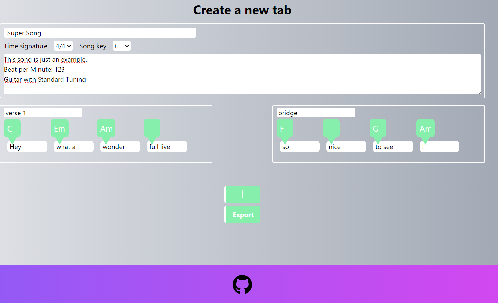

#  Information

this project just started and will be slowly updated :)
The target is to build a page with several tools for helping creating guitar tabs. 

## Getting Started
* Install dependencies
    * <code>npm install</code>
* run dev server
    * <code>npm run dev</code>
    * Visit [Localhost](http://localhost:3000)
* Test GUI
    * npx cypress open

## Screenshots

Create new tab:

## Author

<b>Artur Marks</b>